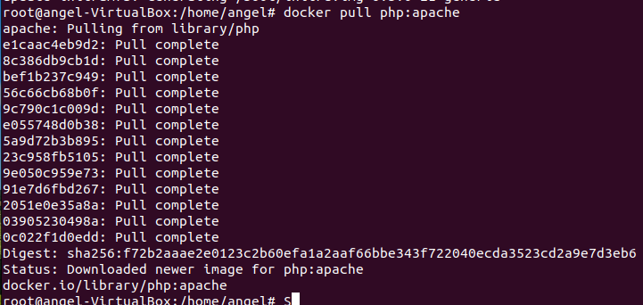
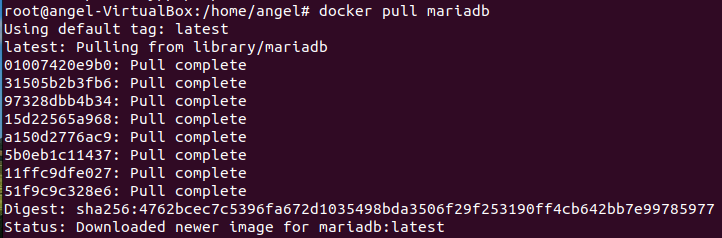
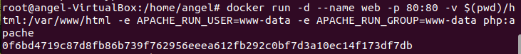
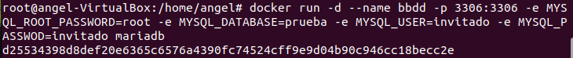
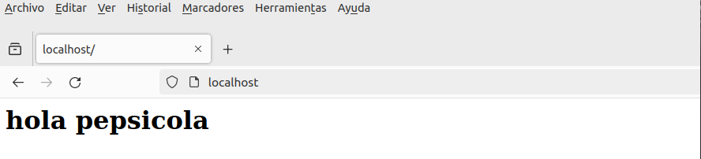
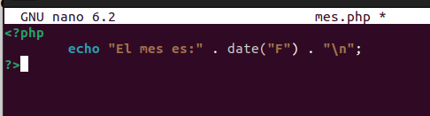
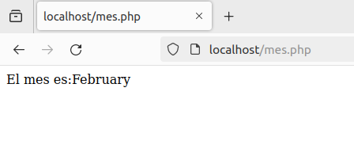
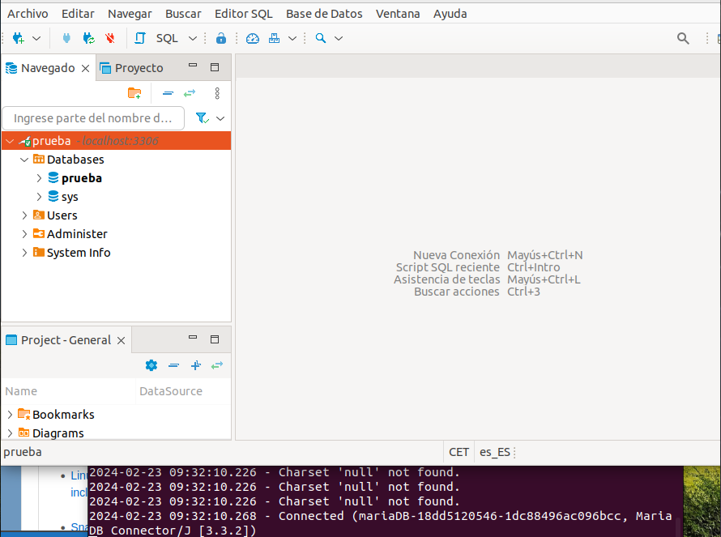
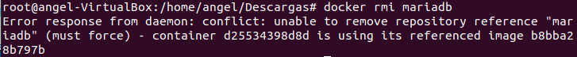

# Ejercicio 1 - Servidor de base de datos

> Realizado por Ángel Durántez, Sergio Álvarez y Adrián Vega

Se nos pide crear dos contenedores. Uno de ellos debe llamarse <u>web</u> y debe ejecutar una imagen con Apache y PHP. El otro contenedor debe llamarse <u>bbdd</u> y debe ejecutar una imagen de mariadb desde el puerto 3306. Para ello lo primero que haremos sera descargarnos las imagenes que necesitamos, con los dos siguientes comandos:

```bash
$docker pull php:apache
$docher pull mariadb
```





A continuación, crearemos los contenedores <u>web</u> y <u>mariadb</u> con los dos siguientes comandos.

```bash
$docker run -d --name web -p 80:80 -v $(pwd)/html:/var/www/html -e APACHE_RUN_USER=www-data -e APACHE_RUN_GROUP=www-data php:apache
$docker run -d --name bbdd -p 3306:3306 -e MYSQL_ROOT_PASSWORD=root -e MYSQL_DATABASE=prueba -e MYSQL_USER=invitado -e MYSQL_PASSWORD=invitado mariadb
```





**Captura de pantalla y documento que desde el navegador muestre el fichero index.html.**



**Captura de pantalla y documento que desde un navegador muestre la salida del script mes.php.**





**Captura de pantalla y documento donde desde un cliente de base de datos (instalado en tu ordenador, por ejemplo dbeaver ) se pueda observar que hemos podido conectarnos al servidor de base de datos con el usuario creado y que se ha creado la base de datos prueba ( show databases ). El acceso se debe realizar desde el ordenador que tenéis instalado docker, no hay que acceder desde dentro del contenedor, es decir, no usar docker exec .**



**Captura de pantalla y documento donde se comprueba que no se puede borrar la imagen mariadb mientras el contenedor bbdd está creado**

