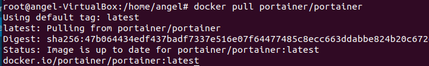
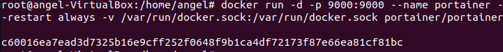
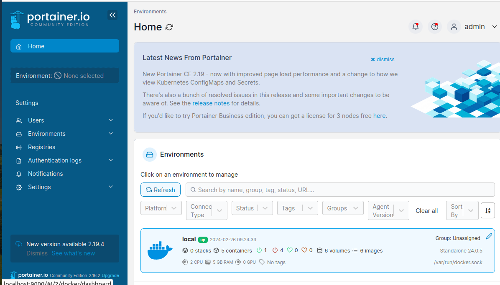
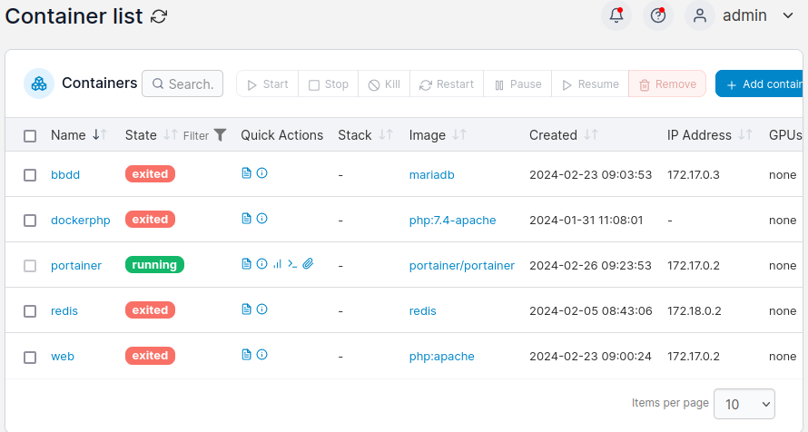
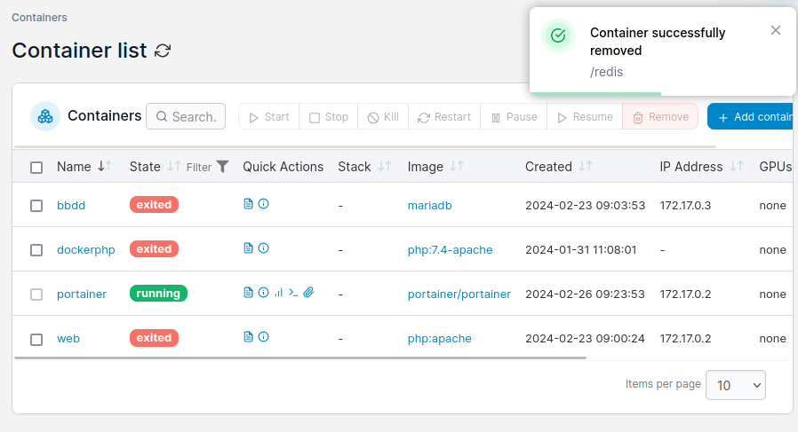
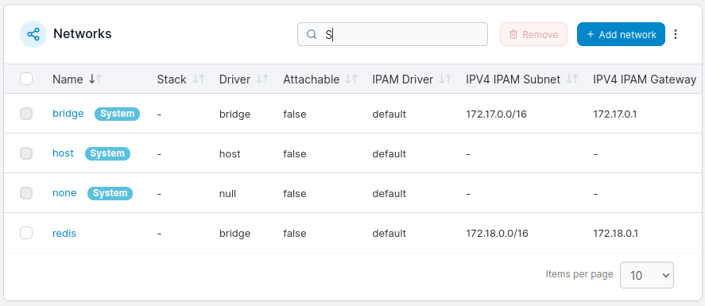
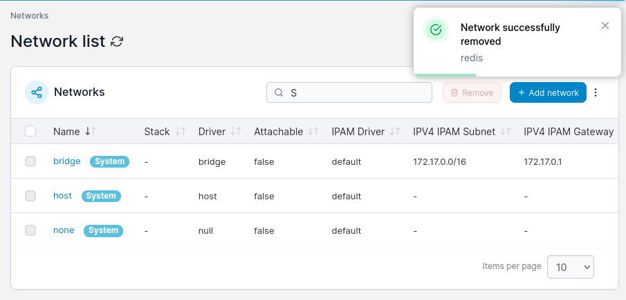
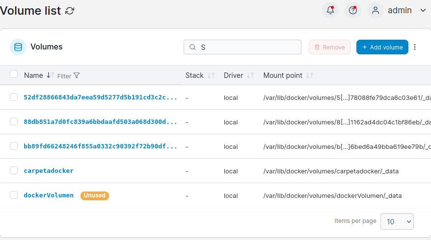

# Ejercicio 2 - Portainer

> Realizado por Ángel Durántez, Sergio Álvarez y Adrián Vega

## **Utiliza una imagen de 'Portainer' para gestionar Docker. **

**Documenta la aplicación, su puesta en funcionamiento y realiza capturas de varias operaciones, por ejemplo:**

Lo primero que haremos será descargar la imagen de portainer con el siguiente comando.

```bash
$docker pull portainer/portainer
```



Seguidamente, crearemos un contenedor de docker con la imagen que acabamos de descargar.

```bash
$docker run -d -p 9000:9000 --name portainer --restart always -v /var/run/docker.sock:/var/run/docker.sock portainer/portainer
```





**Muestra contenedores activos, para un contenedor, borra un contenedor**





El contenedor que borre fue el 'redis'.

**Muestra alguna operación con redes Docker**





La operación que hice con las redes, fue la de borrado de la red que utilizaba el contenedor redis ya que antes he borrado ese contenedor y ya no la necesito.

**Muestra alguna operación con volúmenes Docker**



Cree un volumen --> 'dockerVolumen' como operación con los volúmenes.