# Ejercicio 3 - Contenedores en red: Adminer y MariaDB

> Realizado por Ángel Durántez, Sergio Álvarez y Adrián Vega

crear una red bridge redbd

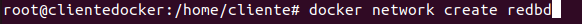

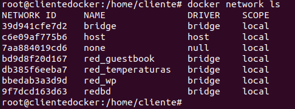

crear contenedor con imagen mariadb

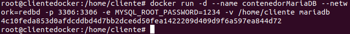

contenedor adminer 

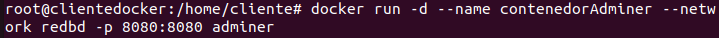

acceso al contenedorMariaDB desde adminer en el localhost:8080

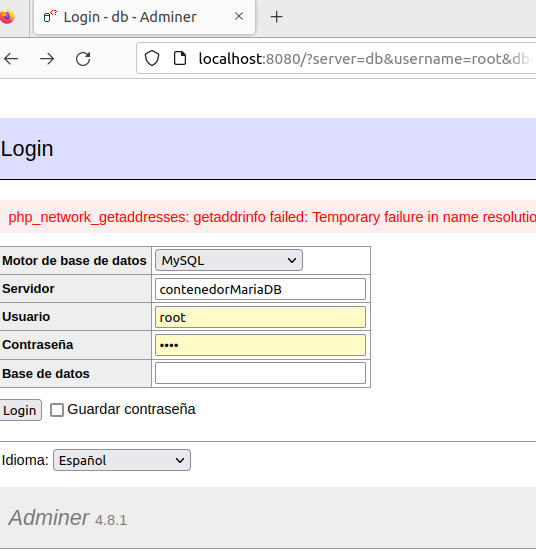

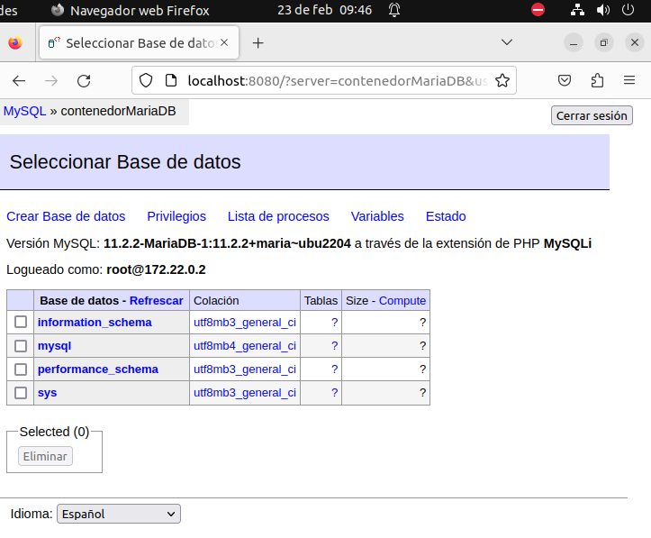

ENTREGA

Contenedores creados y funcionando

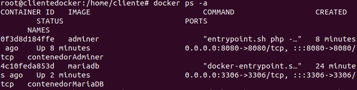

Creacion base de datos interfaz de adminer

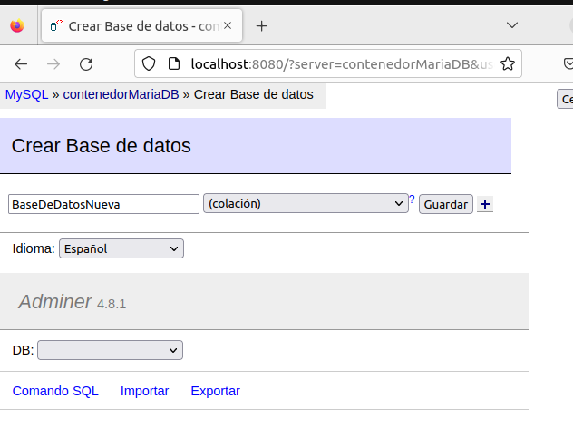

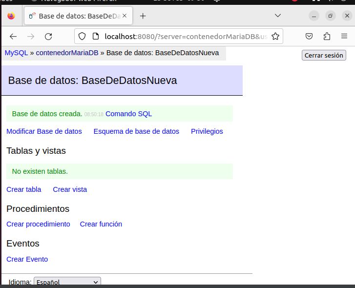

Check de la base de datos nueva en consola

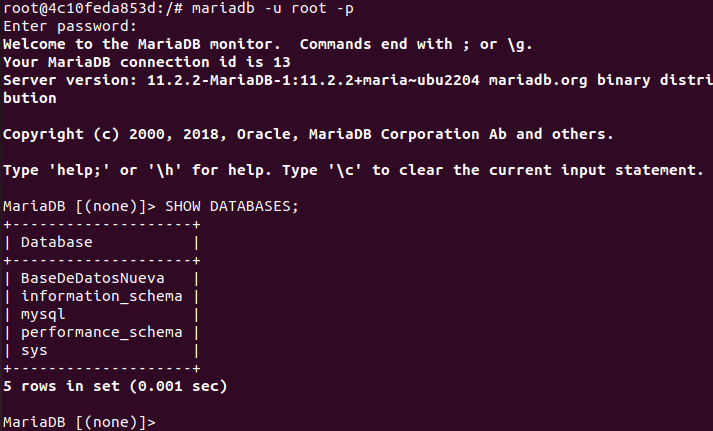

Borrado contenedores

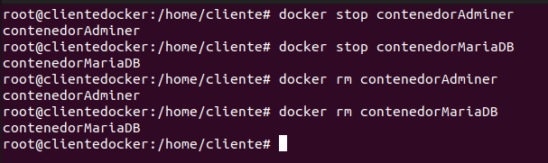