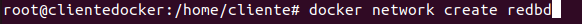
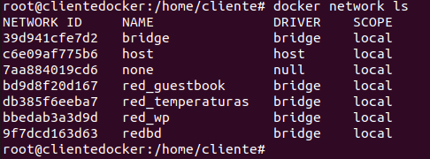
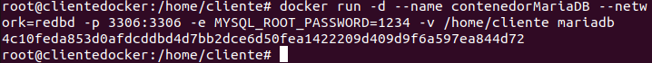
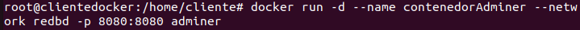
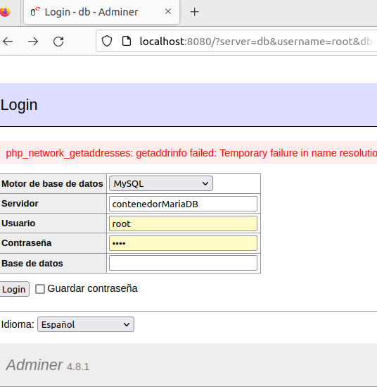
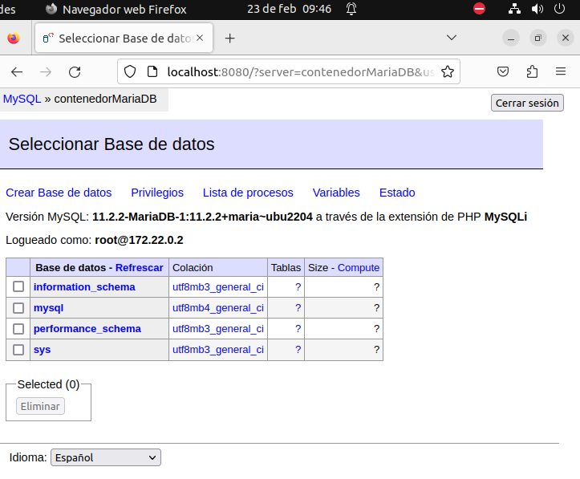
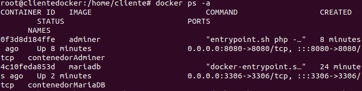
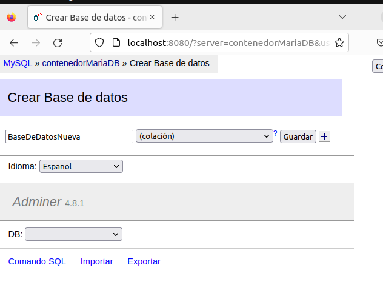
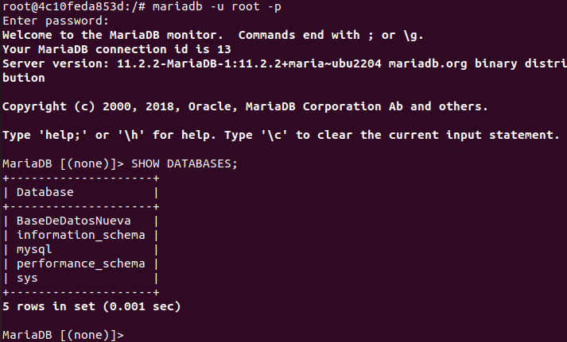
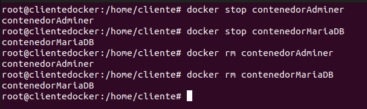

# Ejercicio 3 - Contenedores en red: Adminer y MariaDB

> Realizado por Ángel Durántez, Sergio Álvarez y Adrián Vega

1. Crea una red bridge redbd.

   ```bash
   $docker network create redbd
   $docker network ls
   ```






2. Crea un contenedor con una imagen de mariaDB que estará en la red redbd . Este contenedor se ejecutará en segundo plano, y será accesible a través del puerto 3306. (Es necesario definir la contraseña del usuario root y un volumen de datos persistente)

   ```bash
   $docker run -d --name contenedorMariaDB --network=redbd -p 3306:3306 -e MYSQL_ROOTPASSWORD=1234 -v /home/cliente mariadb
   ```




3. Crear un contenedor con Adminer que se pueda conectar al contenedor de la BD

   ```bash
   $docker run -d --name contenedorAdminer --network=redbd -p 8080:8080 adminer
   ```




4. Comprobar que el contenedor Adminer puede conectar con el contenedor mysql abriendo un navegador web y accediendo a la URL: http://localhost:8080






Captura de pantalla y documento donde se vean los contenedores creados y en ejecución.

```bash
$docker ps -a
```



Captura de pantalla y documento donde se vea el acceso a la BD a través de la interfaz web de Adminer


Captura de pantalla y documento donde se vea la creación de una BD con la interfaz web Adminer




Captura de pantalla y documento donde se entre a la consola del servidor web en modo texto y se compruebe que se ha creado la BD

```bash
$docker exec -it contenedorMariaDB bash
/# mariadb -u root -p
MariaDB [(none)]> SHOW DATABASES;
```



Borrar los contenedores la red y los volúmenes utilizados

```bash
$docker stop contenedorAdminer
$docker stop contenedorMariaDB
$docker rm contenedorAdminer
$docker rm contenedorMariaDB
```

