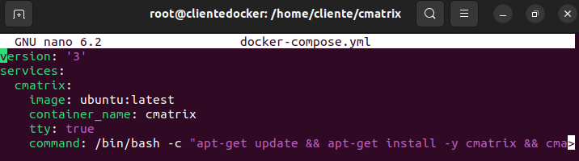
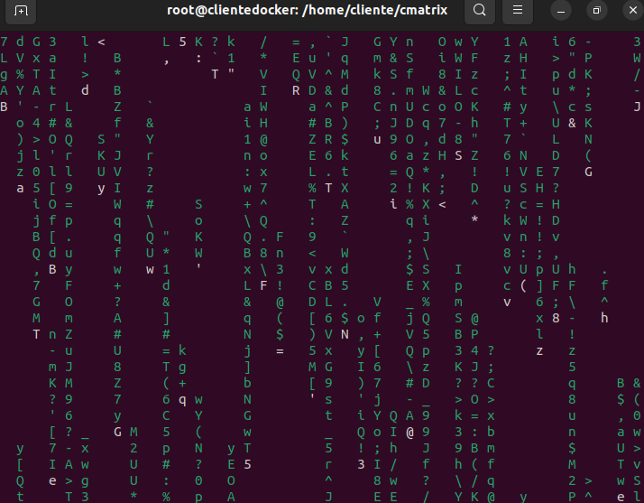

# Ejercicio 4 - CMATRIX

> Realizado por Ángel Durántez, Sergio Álvarez, Adrián Vega

Captura de pantalla y documento donde se vea el fichero docker-compose.yaml .

```bash
Version: '3'
services:
	cmatrix:
		image: ubuntu: latest
		container_name: cmatrix
		tty: true
		command: /bin/bash -c "apt-get update && apt-get install -y cmatrix && cmatrix"
```



Captura de pantalla y documento donde se vea la aplicación funcionando. Se valorará conseguir el efecto Greenrain

```bash
$cmatrix
```



La aplicación al ser ejecutada muestra un fondo de la terminal con distintos caracteres moviéndose en forma de cascada. En función de los parámetros con los que se ejecute se puede personalizar el color de los caracteres.

